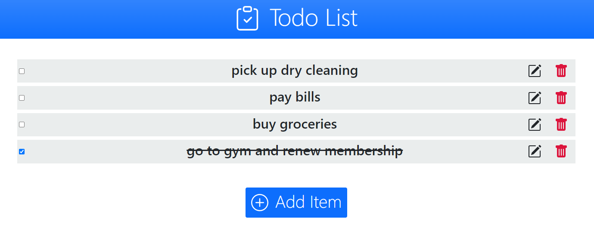
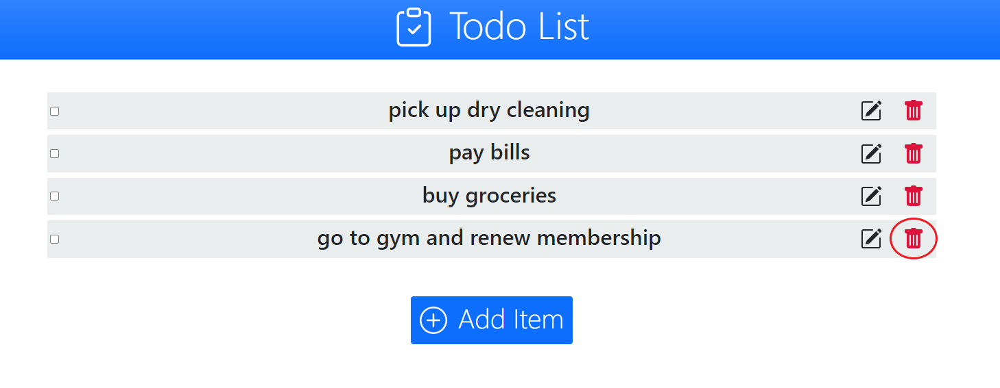

 <h1 align="center">Todo List</h1>

  

## About The Project

This is a web application that functions as a todo list. It was created using .NET 6.0(ASP.NET, Entity Framework Core, and Razor pages), and SQL. Bootstrap, a CSS framework, was also used in the creation of this application. 

 

## Usage
The basic functionality of the application is as follows:
 
 
* Clicking the Add Item button bring the user to the page where they can add a new item. 

* Clicking the edit button will bring the user to the page where they can edit an item. 

* Clicking the checkbox beside any of the items will cross the respective item off of the list.

* Clicking the delete button will delete the respective item from the list.

 

## File Structure

For the backend, a database called Todo_List is used, with a table called Items. The items table stores logged items and there is a model for each item.  The database portion of the project was done in SQL.

Each item in the Item model has a String type property to refer to their descriptions. Along with the database, Entity Framework Core was used as the Object-Relational Mapping framework. The respective files for the backend are as follows:
* appsettings.json contains the connection string used to connect to the Todo_List database.
* program.cs is used for connecting ot the Todo_List database by opening the connection via builder services methods.
* Item.cs contains the model for each item entry.
* ApplicationDbContext.cs is used for passing database sets to the database.
* TodoListConroller.cs is the controller for the various views in the project.

For the frontend, ASP.NET was used for the UI framework, and Bootstrap was used as the CSS framework. It's made up of the following files:
* Index.cs is the main page of the program
* Layout.cshtml renders the navbar
* AddItem.cshtml is the page where users add items.
* EditItem.cshtml is the page where users edit items.
* DeleteItem.cshtml is the page where users delete items.
* site.css is used to provide addition css formating to the views.

 

## Prerequisites
The following nuget packages must be installed via the NuGet package manager is Visual Studio:
* Microsoft.AspNetCore.Razor.RuntimeCompilation for razor pages and tag helpers
* Microsoft.EntityFrameworkCore for using Entity Framework Core
* Microsoft.EntityFrameworkCore.sqlserver for connecting to the database
* Microsoft.EntityFrameworkCore.Tools for migrations
